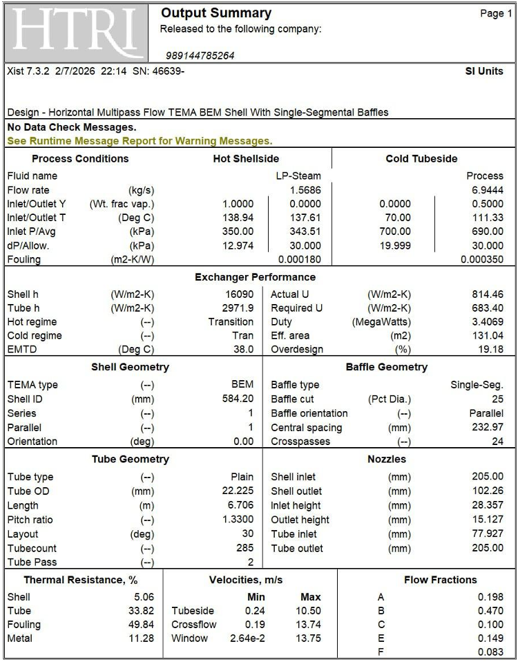
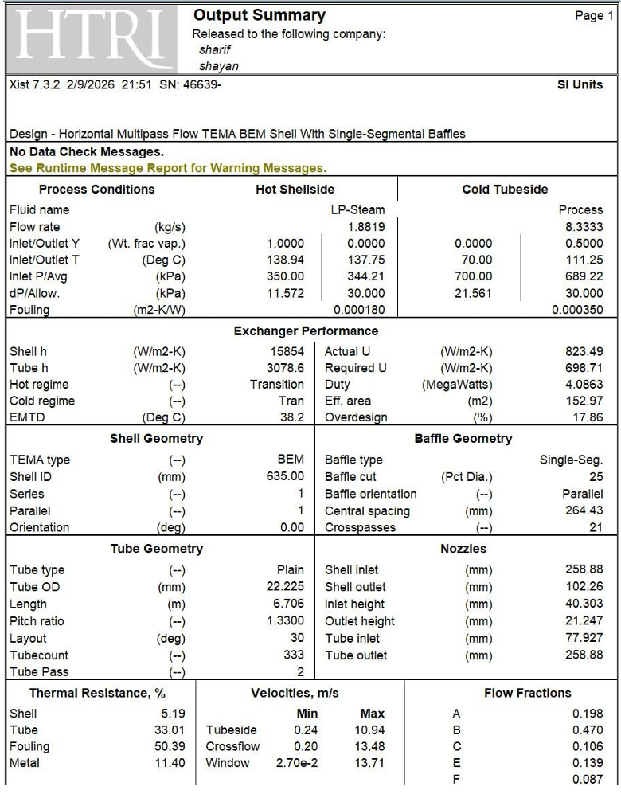

<div align="center">

# Industrial Reboiler Heat Exchanger Design & Debottlenecking
### TEMA BEM Configuration | Sour Hydrocarbon Mixture Vaporization

[](http://mech.sharif.edu/)
[](#summary-of-thermal-hydraulic-performance)
[](./report/Heat_Exchanger.tex)
[](#engineering-decisions--basis-of-design)

<p align="center">
  <b>A comprehensive thermal-hydraulic design, simulation, and capacity expansion analysis for a shell-and-tube reboiler in the sour gas sweetening plant of Ilam Gas Refinery.</b>
</p>

[View Full Report (PDF)](./report/Design_of_a_Heat_Exchanger.pdf) • [View LaTeX Source](./report/Heat_Exchanger.tex)

</div>

---

## Table of Contents
- [Project Overview](#project-overview)
- [Engineering Decisions & Basis of Design](#engineering-decisions--basis-of-design)
  - [Fluid Allocation Justification](#1-fluid-allocation-justification)
  - [Exchanger Architecture (TEMA BEM)](#2-exchanger-architecture-tema-bem)
  - [Metallurgy & Geometry](#3-metallurgy--geometry)
- [Summary of Thermal-Hydraulic Performance](#summary-of-thermal-hydraulic-performance)
- [Non-Linear Scaling: Area vs. Throughput](#non-linear-scaling-area-vs-throughput)
- [HTRI Runtime Messages & Engineering Resolutions](#htri-runtime-messages--engineering-resolutions)
- [Simulation Sheets & Outputs](#simulation-sheets--outputs)
  - [Base Case Data (25,000 kg/hr)](#base-case-data-25000-kghr)
  - [Debottlenecked Case Data (30,000 kg/hr)](#debottlenecked-case-data-30000-kghr)
- [Repository Structure](#repository-structure)

---

## Project Overview

In natural gas sweetening facilities, thermal duty must be supplied to the bottom of the amine regeneration column (stripper) to separate acid gases ($\text{CO}_2$, $\text{H}_2\text{S}$) from the solvent. This project covers the thermal-hydraulic sizing and subsequent debottlenecking of an industrial reboiler unit.

* **Process Duty:** Vaporize a ternary, corrosive sour mixture (**50 wt% Water, 25 wt% Ammonia, and 25 wt% Benzene**) from $x_{\text{in}} = 0.0$ (saturated liquid) to $x_{\text{out}} = 0.50$ (50% vapor by weight).
* **Utility Stream:** Low-Pressure Utility Steam (LP-Steam) condensing from $x_{\text{in}} = 1.0$ (dry saturated steam) to $x_{\text{out}} = 0.0$ (saturated liquid condensate).
* **Throughput Range:** Base design at **25,000 kg/hr** (3.41 MW) expanded by **+20%** to a debottlenecked target of **30,000 kg/hr** (4.09 MW).

---

## Engineering Decisions & Basis of Design

### 1. Fluid Allocation Justification
* **Tubeside $\to$ Process Fluid:**
  * **Corrosion Control:** The stream contains 25% aggressive ammonia ($\text{NH}_3$). Allocating this stream inside the tubes allows the selective use of corrosion-resistant **Stainless Steel 304** tubing, eliminating the capital expenditure of constructing a large alloyed pressure vessel shell.
  * **Pressure Containment:** Operating pressure inside tubes ($7.0\text{ bar}$) exceeds shellside utility pressure ($3.5\text{ bar}$). Placing the higher-pressure fluid inside tubes minimizes shell wall thickness and overall fabrication costs.
* **Shellside $\to$ Utility Steam (LP-Steam):**
  * Clean, low-fouling condensing steam ($R_f = 0.00018\text{ m}^2\text{K/W}$) over horizontal bundles yields an extremely high condensing heat transfer coefficient ($h_o \approx 16{,}000\text{ W/m}^2\text{K}$).

### 2. Exchanger Architecture (TEMA BEM)
* **Front Head (Type B - Bonnet):** Economical and mechanically rigid bolted closure. For continuous sour service with periodic chemical clean-in-place (CIP), frequent bundle disassembly is unnecessary.
* **Shell (Type E - One-Pass):** Standard industrial single-pass configuration for phase-change applications, providing counter-current crossflow characteristics.
* **Rear Head (Type M - Fixed Tubesheet):** The fixed tubesheet construction features the lowest manufacturing cost. Eliminating internal floating-head gaskets completely avoids the risk of toxic ammonia or benzene leaking into the utility steam condensate return line.

### 3. Metallurgy & Geometry
* **Tube Metallurgy:** Austenitic Stainless Steel 304 (18Cr-8Ni). Copper-based alloys (brass, bronze) are strictly prohibited due to severe ammonia-induced stress corrosion cracking (SCC).
* **Shell Metallurgy:** Structural Carbon Steel (suitable for clean utility steam).
* **Tube Geometry:** $\text{OD} = 22.225\text{ mm}$ ($7/8\text{ in}$), average wall thickness $t_w = 2.108\text{ mm}$, active length $L = 6.706\text{ m}$.
* **Bundle Layout:** $30^\circ$ Triangular pitch ($\text{Pitch Ratio} = 1.33$, $\text{Pitch} = 29.56\text{ mm}$) to achieve maximum packing density and tube count in a given shell diameter.
* **Baffling Configuration:** Carbon steel single-segmental cross baffles with 25% diametral cut and central baffle spacing of approximately 233 mm (24 crosspasses).

---

## Summary of Thermal-Hydraulic Performance

The exchanger was modeled and optimized in **HTRI Xist v7.3.2**. The table below summarizes the thermal-hydraulic ratings for the base operating point and the +20% debottlenecked case:

| Design Parameter | Units | Baseline Case (25,000 kg/hr) | Debottlenecked Case (30,000 kg/hr) | Engineering Notes |
| :--- | :---: | :---: | :---: | :--- |
| **Thermal Duty ($Q$)** | MW | **3.407** | **4.086** | $+19.9\%$ (Directly proportional to mass throughput) |
| **Shell Inside Diameter** | mm | **584.20** | **635.00** | Resized to house expanded bundle |
| **Total Tube Count ($N_t$)** | — | **285** | **333** | $+16.8\%$ tube count addition |
| **Number of Tube Passes** | — | **2 passes** | **2 passes** | Enforces annular flow regime |
| **Overall $U$ (Actual)** | $\text{W/m}^2\text{K}$ | **814.46** | **823.49** | $+1.1\%$ enhancement due to higher turbulence |
| **Required Service $U$** | $\text{W/m}^2\text{K}$ | **683.40** | **698.71** | Includes specified fouling factors |
| **Effective Surface Area** | $\text{m}^2$ | **131.04** | **152.97** | $+16.7\%$ surface growth (Sub-linear scaling) |
| **Tubeside $\Delta P$ (Calc / Allow)** | kPa | **19.99** / 30.00 | **21.56** / 30.00 | Safe margin below 30 kPa threshold |
| **Shellside $\Delta P$ (Calc / Allow)** | kPa | **12.97** / 30.00 | **11.57** / 30.00 | Hydraulic limits respected |
| **Overdesign Margin** | % | **19.18%** | **17.86%** | Robust long-term fouling buffer |

---

## Non-Linear Scaling: Area vs. Throughput

A core theoretical objective of this analysis is whether heat transfer area scales linearly with throughput:

$$Q = U \cdot A \cdot \Delta T_{\text{LM}}$$

1. Scaling mass flow by $+20\%$ proportionally scales the duty ($Q$) by $+19.9\%$.
2. Increased mass flux enhances in-tube mixture velocity, elevating the Reynolds number ($Re$).
3. In forced convective two-phase boiling regimes, convective transfer scales with $h_{i} \propto Re^{0.8}$. The tubeside coefficient increases from $2971.9\text{ W/m}^2\text{K}$ to $3078.6\text{ W/m}^2\text{K}$, lifting the overall heat transfer coefficient from $814.5$ to $823.5\text{ W/m}^2\text{K}$.
4. Consequently, the required heat transfer area exhibits **sub-linear scaling**:

$$\frac{dA}{d\dot{m}} < \frac{A_0}{\dot{m}_0} \implies \Delta A = +16.74\text{\%} \quad \text{for} \quad \Delta \dot{m} = +20.00\text{\%}$$

---

## HTRI Runtime Messages & Engineering Resolutions

* **Terminal Temperature Inconsistency (`Run Failed`):**
  * *Root Cause:* Inconsistent stream pressure conversion and thermodynamic flash property mismatches.
  * *Resolution:* Standardized operating pressures into consistent absolute Pascal units and aligned inlet flash curves.
* **Wavy Stratified Flow & Partial Dryout:**
  * *Root Cause:* Low liquid mass velocity in horizontal tubes allows phase stratification by gravity, causing dryout at the upper tube wall.
  * *Resolution:* Shifted from single-pass to a **2-pass tube configuration**, raising in-tube velocity and shifting the flow regime to dispersed annular flow.
* **Shell Inlet Kinetic Momentum ($\rho V^2 > 1000\text{ kg/m}\cdot\text{s}^2$):**
  * *Root Cause:* Nozzle momentum of the incoming LP-steam reached $\rho V^2 = 1199.8\text{ kg/m}\cdot\text{s}^2$, presenting vibration and impingement erosion hazards.
  * *Resolution:* Specified shell inlet **Impingement Rods** and verified bundle entrance areas per **TEMA Paragraph RCB-4.61**.
* **Transition Boiling Warning:**
  * *Analysis:* Localized transition between nucleate and film boiling was flagged. Since the overall effective mean temperature difference is moderate ($\text{EMTD} \approx 38^\circ\text{C}$), local peak fluxes remain well beneath the Critical Heat Flux ($q'' < q''_{\text{CHF}}$), preventing sustained dryout.

---

## Simulation Sheets & Outputs

### Base Case Data (25,000 kg/hr)
<div align="center">
  
  <p><i>Figure 1: HTRI Specification Sheet for Base Case (25,000 kg/hr, 285 Tubes).</i></p>
  <br/>
  
  <p><i>Figure 2: HTRI Output Summary and Thermal Resistance Breakdown for Base Case.</i></p>
</div>

---

### Debottlenecked Case Data (30,000 kg/hr)
<div align="center">
  
  <p><i>Figure 3: HTRI Specification Sheet for Debottlenecked Case (30,000 kg/hr, 333 Tubes).</i></p>
  <br/>
  
  <p><i>Figure 4: HTRI Output Summary and Thermal Resistance Breakdown for Debottlenecked Case.</i></p>
</div>

---

## Repository Structure

```text
.
├── Figures/
│   ├── f1.png                     # HTRI Specification Sheet (Base Case - 25,000 kg/hr)
│   ├── f2.png                     # HTRI Specification Sheet (Debottlenecked Case - 30,000 kg/hr)
│   ├── f3.png                     # HTRI Output Summary Report (Base Case)
│   └── f4.png                     # HTRI Output Summary Report (Debottlenecked Case)
│
├── report/
│   ├── Design_of_a_Heat_Exchanger.pdf  # Compiled technical report
│   └── Heat_Exchanger.tex              # Complete LaTeX source code
│
└── README.md                      # Engineering portfolio documentation
