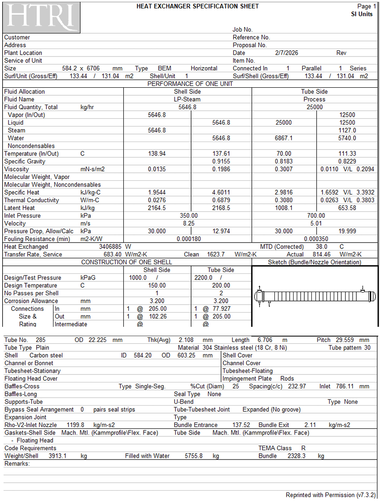
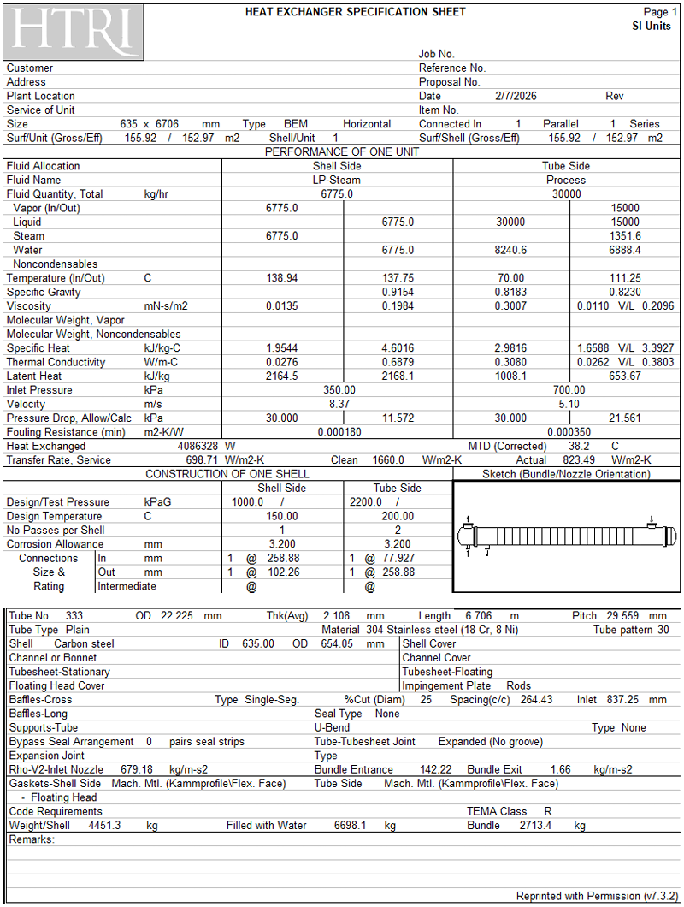

<div align="center">

# 🏭 Industrial Reboiler Heat Exchanger Design & Debottlenecking
### TEMA BEM Configuration | Sour Hydrocarbon Vaporization

[](http://mech.sharif.edu/)
[](#summary-of-thermal-hydraulic-performance)
[](./report/Heat%20Exchanger.tex)
[](#engineering-decisions--basis-of-design)

<p align="center">
  <b>A rigorous thermal-hydraulic design and debottlenecking analysis for a shell-and-tube reboiler in the gas sweetening plant of Ilam Gas Refinery.</b>
</p>

[📄 View Full Report (PDF)](./report/Design_of_a_Heat_Exchanger.pdf) • [📝 View LaTeX Source](./report/Heat%20Exchanger.tex) 

</div>

---

## 📑 Table of Contents
- [Project Overview](#project-overview)
- [Engineering Decisions & Basis of Design](#engineering-decisions--basis-of-design)
  - [Fluid Allocation Justification](#1-fluid-allocation-justification)
  - [Exchanger Architecture](#2-exchanger-architecture-tema-bem)
  - [Metallurgy & Geometry](#3-metallurgy--geometry)
- [Summary of Thermal-Hydraulic Performance](#summary-of-thermal-hydraulic-performance)
- [Non-Linear Scaling: Area vs. Throughput](#non-linear-scaling-area-vs-throughput)
- [HTRI Runtime Messages & Engineering Resolutions](#htri-runtime-messages--engineering-resolutions)
- [HTRI Specification Sheets](#htri-specification-sheets)
  - [Base Case Specification Sheet](#base-case-specification-sheet)
  - [Debottlenecked Case Specification Sheet](#debottlenecked-case-specification-sheet)
- [Repository Structure](#repository-structure)

---

## 📌 Project Overview

In natural gas sweetening units, thermal energy must be continuously supplied to the bottom of the regenerator stripper to liberate acid gases ($\text{CO}_2$, $\text{H}_2\text{S}$) and regenerate lean amine. 

* **Duty:** Vaporize a ternary, highly corrosive process mixture consisting of **50 wt% Water, 25 wt% Ammonia, and 25 wt% Benzene** from $x_{\text{in}} = 0.0$ to $x_{\text{out}} = 0.50$.
* **Heating Medium:** Low-Pressure Utility Steam (LP-Steam) condensing from $x_{\text{in}} = 1.0$ to saturated condensate $x_{\text{out}} = 0.0$.
* **Target Throughput:** Base operation at **25,000 kg/hr** (3.41 MW) with debottlenecking capability up to **30,000 kg/hr** (4.09 MW, $+20\%$ capacity expansion).

---

## ⚙️ Engineering Decisions & Basis of Design

### 1. Fluid Allocation Justification
* **Tubeside $\to$ Process Stream:**
  * **Corrosion Control:** The fluid contains 25% Ammonia ($\text{NH}_3$). Allocating this fluid inside the tubes allows localized use of austenitic **Stainless Steel 304 (18Cr, 8Ni)** tubing, preventing the prohibitive expense of fabricating a high-alloy shell vessel.
  * **Pressure Containment:** Operating pressure tubeside ($7.0\text{ bar}$) is double the shell pressure ($3.5\text{ bar}$). Flowing the high-pressure stream tubeside significantly reduces shell thickness and vessel weight.
* **Shellside $\to$ LP-Steam Utility:**
  * Clean, non-fouling condensing steam ($R_f = 0.00018\text{ m}^2\text{K/W}$) across horizontal tube bundles delivers an exceptionally high outer convective film coefficient ($h_o \approx 16{,}000\text{ W/m}^2\text{K}$).

### 2. Exchanger Architecture (TEMA BEM)
* **Front Head (Type B - Bonnet):** Economical and rigid closure. Frequent internal physical cleaning of tubes is unnecessary in continuous sour service; chemical cleaning is preferred.
* **Shell (Type E - One-Pass):** Classic single-pass arrangement providing optimal counter-current crossflow.
* **Rear Head (Type M - Fixed Tubesheet):** Fixed tubesheets feature the lowest capital cost. Most importantly, eliminating internal floating-head packings removes any risk of toxic $\text{NH}_3$ / Benzene leakage into the plant utility steam condensate line.

### 3. Metallurgy & Geometry
* **Tube Metallurgy:** Austenitic Stainless Steel 304 (strictly excludes copper-based alloys due to ammonia stress-corrosion cracking).
* **Shell Metallurgy:** Structural Carbon Steel.
* **Tube Dimensions:** $\text{OD} = 22.225\text{ mm}$ ($7/8\text{ in}$), wall thickness $t_w = 2.108\text{ mm}$, active length $L = 6.706\text{ m}$.
* **Bundle Layout:** $30^\circ$ Triangular pitch ($\text{Pitch Ratio} = 1.33$, $\text{Pitch} = 29.56\text{ mm}$) to yield maximum heat transfer area per unit shell diameter.
* **Baffling:** Single-segmental carbon steel baffles with 25% diametral cut and 233 mm spacing (24 crosspasses).

---

## 📊 Summary of Thermal-Hydraulic Performance

The exchanger was designed in **Design Mode** for baseline throughput and subsequently evaluated in **Rating Mode** for capacity expansion (+20% mass flow).

| Design Parameter | Units | Baseline Case (25,000 kg/hr) | Debottlenecked Case (30,000 kg/hr) | Engineering Assessment |
| :--- | :---: | :---: | :---: | :--- |
| **Thermal Duty ($Q$)** | MW | **3.407** | **4.086** | +19.9% (Directly proportional to flow) |
| **Shell Inside Diameter** | mm | **584.20** | **635.00** | Scaled to house expanded tube bundle |
| **Total Tube Count ($N_t$)** | — | **285** | **333** | +16.8% tube count expansion |
| **Tube Passes** | — | **2 passes** | **2 passes** | Preserves core turbulence & velocity |
| **Overall $U$ (Actual)** | W/m²·K | **814.46** | **823.49** | +1.1% enhancement via higher *Re* |
| **Required Service $U$** | W/m²·K | **683.40** | **698.71** | Governed by fouling safety factors |
| **Effective Heat Transfer Area** | m² | **131.04** | **152.97** | Sub-linear area requirement (+16.7%) |
| **Tubeside $\Delta P$ (Calc / Allow)** | kPa | **19.99** / 30.00 | **21.56** / 30.00 | Well within allowable limits |
| **Shellside $\Delta P$ (Calc / Allow)** | kPa | **12.97** / 30.00 | **11.57** / 30.00 | Hydraulic margins preserved |
| **Overdesign Margin** | % | **19.18%** | **17.86%** | High operational safety buffer |

---

## 📈 Non-Linear Scaling: Area vs. Throughput

A fundamental question addressed in this design is whether surface area requirements scale linearly with flow rate (+20% flow vs. +20% area).

$$Q = U \cdot A \cdot \Delta T_{\text{LM}}$$

1. Scaling mass throughput by 20% proportionally elevates total vaporization duty: $\Delta Q \approx +20\%$.
2. Higher flow elevates tubeside mass velocity, directly boosting the **Reynolds number ($Re$)**.
3. In forced convective two-phase boiling, the convective coefficient follows $h_i \propto Re^{0.8}$. The tubeside film coefficient rises from 2971.9 W/m²·K to 3078.6 W/m²·K, driving overall clean and actual $U$ upward (814.5 $\to$ 823.5 W/m²·K).
4. Because the overall heat transfer coefficient improves dynamically, the required heat transfer surface area scales **sub-linearly**:

$$\frac{dA}{d\dot{m}} < \frac{A_0}{\dot{m}_0} \quad \implies \quad \Delta A = +16.74\% \quad \text{for} \quad \Delta \dot{m} = +20.0\%$$

---

## 🛠️ HTRI Runtime Messages & Engineering Resolutions

During iterative convergence in HTRI Xist, several warnings were addressed:

* ⚠️ **Terminal Temperature Inconsistency (`Run Failed`):**  
  * *Root Cause:* Mismatch in equilibrium flash curves and inconsistent pressure conversions.  
  * *Resolution:* Standardized operating pressure boundary conditions in absolute Pascal units and aligned inlet flash conditions.
* ⚠️ **Wavy Stratified Flow & Upper Surface Dryout:**  
  * *Root Cause:* Low liquid mass flux inside single-pass horizontal tubes causes gravity separation of vapor and liquid, leading to dryout at upper wall perimeters.  
  * *Resolution:* Adopted a **2-pass tube layout**. Increased mixture velocity enforced dispersed annular flow, eliminating dryout warnings.
* ⚠️ **Shellside Inlet Kinetic Momentum ($\rho V^2 > 1000\text{ kg/m}\cdot\text{s}^2$):**  
  * *Root Cause:* Inlet LP-steam nozzle jet velocity produced $\rho V^2 = 1199.8\text{ kg/m}\cdot\text{s}^2$, posing flow-induced tube vibration and erosion threats.  
  * *Resolution:* Integrated shell inlet **Impingement Rods** and adjusted bundle entrance ratios in accordance with TEMA Section 5.
* ⚠️ **Transition Boiling Increment Warning:**  
  * *Analysis:* Localized transitions between nucleate and film boiling were reported. Because overall EMTD is moderate ($\approx 38^\circ\text{C}$), peak local fluxes remain well beneath Critical Heat Flux ($q'' < q''_{\text{CHF}}$), ensuring thermal stability.

---

## 📑 HTRI Specification Sheets

### 🔹 Base Case Specification Sheet
*(Throughput: 25,000 kg/hr | Heat Duty: 3.41 MW | 285 Tubes)*

<div align="center">
  
</div>

---

### 🔹 Debottlenecked Case Specification Sheet
*(Throughput: 30,000 kg/hr | Heat Duty: 4.09 MW | 333 Tubes)*

<div align="center">
  
</div>

---

## 📁 Repository Structure

```text
Project_01_Reboiler/
│
├── Figures/                               # Simulation data sheets & plots
│   ├── f1.png                             # HTRI Specification Sheet (Base Case)
│   ├── f2.png                             # HTRI Specification Sheet (Debottlenecked Case)
│   ├── f3.png                             # HTRI Base Case Output Summary
│   └── f4.png                             # HTRI Debottlenecked Output Summary
│
├── report/
│   ├── Design_of_a_Heat_Exchanger.pdf     # Complete compiled technical report
│   └── Heat Exchanger.tex                 # Professional LaTeX source code
│
└── README.md                              # Technical documentation & project portfolio
